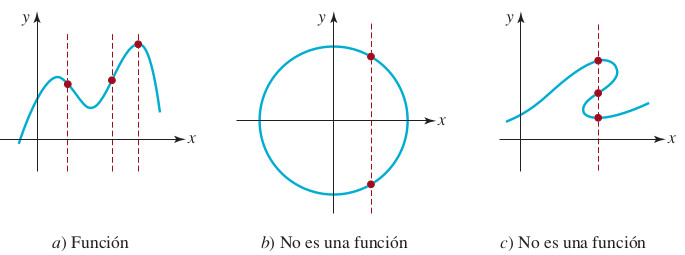
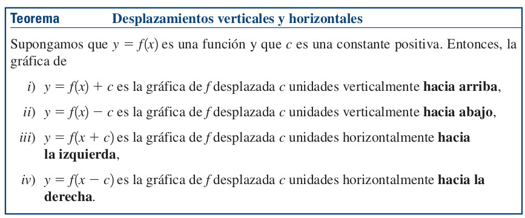
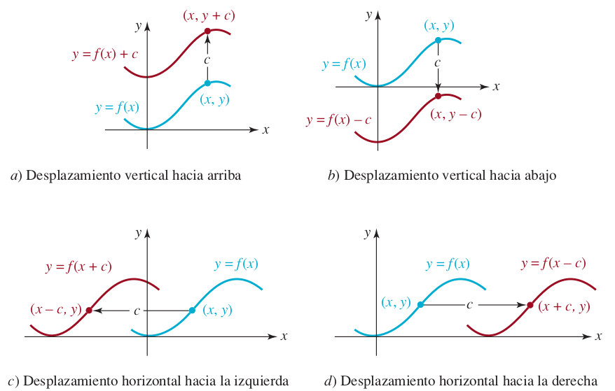
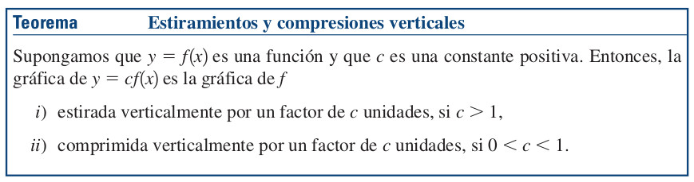

# Introducción {#intro}

<!-- You can label chapter and section titles using `{#label}` after them, e.g., we can reference Chapter \@ref(intro). If you do not manually label them, there will be automatic labels anyway, e.g., Chapter \@ref(methods). -->

<!-- Figures and tables with captions will be placed in `figure` and `table` environments, respectively. -->

<!-- ```{r nice-fig, fig.cap='Here is a nice figure!', out.width='80%', fig.asp=.75, fig.align='center'} -->
<!-- par(mar = c(4, 4, .1, .1)) -->
<!-- plot(pressure, type = 'b', pch = 19) -->
<!-- ``` -->

<!-- Reference a figure by its code chunk label with the `fig:` prefix, e.g., see Figure \@ref(fig:nice-fig). Similarly, you can reference tables generated from `knitr::kable()`, e.g., see Table \@ref(tab:nice-tab). -->

<!-- ```{r nice-tab, tidy=FALSE} -->
<!-- knitr::kable( -->
<!--   head(iris, 20), caption = 'Here is a nice table!', -->
<!--   booktabs = TRUE -->
<!-- ) -->
<!-- ``` -->


## Concepto de función


$$
X \subseteq R \ \ \ \ \ \ \longrightarrow \ \ Y \subseteq R\\
 \ \ \ \ \ \ \ \ \ x\ \ \ \ \ \ \  \ \ \ \longmapsto \ y=f(x)
$$
<br></br>

```{r ConceptoDeFuncion01, fig.cap="Concepto de función real [Imagen tomada de [@zill2011matematicas] pág $22$]", fig.align='center' ,echo=FALSE, message=FALSE,  warning=FALSE}
knitr::include_graphics("images/ConceptoDeFuncion0.jpg")
```

<br></br>

Una función es una relación especial entre dos conjuntos $X=D_{f}$ y $Y=R_{f}$, donde a todo elemento $x$ del conjunto $X$ le corresponde uno y sólo un elemento $y$ del conjuto $Y$. Cuando esta relación cumple la propiedad enunciada, diremos que la relación es una función. Es bueno recordar que no toda relación es función.

La siguiente gráfica ilustra la relación entre dos conjuntos en el plano $XY$, donde se muestra que cada punto de la gráfica es una pareja ordenada $(x_i,f(x_i))$.

<br></br>

```{r ConceptoDeFuncion2, fig.cap="Correspondencia entre cada valor $x$ y $y$ [Imagen tomada de [@zill2011matematicas] pág $24$]", fig.align='center' ,echo=FALSE, message=FALSE,  warning=FALSE}
knitr::include_graphics("images/ConceptoDeFuncion2.jpg")
```


<br></br>


```{definition}
Se define el dominio de una función $f$ como el subconjunto mayor de los números reales para el cual la imágen através de $f$ es un número real.
```

<br></br>


<span style="color:red">**NOTA**</span>: Si los conjuntos $X$ y $Y$ son subconjuntos del conjunto de los números reales, diremos que la función es de variable real. Al cojunto $X=D_{f}$ le llamaremos **dominio** de la función $f$, al conjunto $Y=R_{f}$ le llamaremos **rando** de la función.


Existe un  <span style="color:red">**criterio gráfico**</span> que se usa para determinar si una relación desde su gráfica representa una función, este criterio se llama **criterio de la recta vertical**.


En el siguiente link se puede ejemplificar el uso de este criterio. Haga clic en el link adjunto para poder ver dichos ejemplos.


```{r ConceptoDeFuncion1, fig.cap="Criterio de la recta vertical [Imagen tomada de [@zill2011matematicas] pág $24$]", fig.align='center' ,echo=FALSE, message=FALSE,  warning=FALSE, out.width = "56%"}

```


## Criterio de la recta vertical


[Link para aplicar el criterio de la recta vertical](https://johnclasesuces.shinyapps.io/ConceptoFuncionGrafica1/)


<br></br>


## Domingo y rango de una función

```{r ConceptoDominioYRango1, fig.cap="Concepto de dominio y rango para una función de variable real [Imagen tomada de [@zill2011matematicas] pág $24$]", fig.align='center' ,echo=FALSE, message=FALSE,  warning=FALSE, out.width = "40%"}
knitr::include_graphics("images/DominioYRango1.jpg")
```


### Ejemplo1 Dominio y Rango

[Link primer ejemplo dominio y rango](https://johnclasesuces.shinyapps.io/DominioYRango1/)


[Link segundo ejemplo dominio y rango](https://johnclasesuces.shinyapps.io/DominioYRangoPorTramos1/)


<br></br>

### Ejemplo2 Dominio y Rango


```{example}
Determinar el dominio y rango para la función 

\[
y=f(x)=\dfrac{2x+3}{x-3}  
\]  
Usando la técnica del despeje.
```


<br></br>


```{solution}
Recordar para obtener el dominio de una función se debe despejar la letra dependiente $y$ de ser necesario; pero en este caso no fue necesario ya que el enunciado entrega la letra $y$ despejada, y ya que es una fracción, el problema se concentra en el análisis de donde se vuelve cero el denominador. Como el denominador se vuelve cero en $x=3$, podemos concluir que el dominio para esta función es:

\[
D_f: \ x \in R-\{3\}  \qquad \text{ ó equivalentemente } \qquad D_f: \ x\in (-\infty,3)\cup (3,+\infty)
\]

Ahora para obtener el rango de la función debes recordar despejar la letra $x$, así en este caso:
  
\begin{equation} \label{eqDom1}
\begin{split}
y & =\dfrac{2x+3}{x-3}\\
y(x-3)& =(2x+3)\\
xy-3y & = 2x+3\\
xy-2x & = 3+3y\\
x(y-2) & = 3(1+y)\\
x & = \dfrac{3(1+y)}{y-2}
\end{split}
\end{equation}
Como el proceso de despeje genero una fracción entonces el análisis para el rango se concentra en el denominador. Se ve que el denominador se vuelve cero en $y=2$. Por lo tanto el rango de $f$, será:
  
\[
R_f: \ y \in R-\{2\}  \qquad \text{ ó equivalentemente } \qquad R_f: \ y\in (-\infty,2)\cup (2,+\infty)
\]
```


<br></br>

### Ejemplo3 Dominio y Rango


```{example}
Determinar el dominio y rango para la función 

\[
y=f(x)=\sqrt{x-2}  
\]  
Usando la técnica del despeje.
```


<br></br>


```{solution}
Recordar para obtener el dominio de una función se debe despejar la letra dependiente $y$ de ser necesario; pero en este caso no fue necesario ya que el enunciado entrega la letra $y$ despejada, y ya que es una raíz cuadrada, el problema se concentra en el análisis de donde se vuelve cero y positivo el radicando (e.d. la expresión que esta dentro de la raíz). En términos de desigualdades:
  
\[
x-2 \geq 0  \qquad \text{ de donde } \qquad x \geq 2
\]  
  


\[
D_f: \ x \in R-(-\infty,2)  \qquad \text{ ó equivalentemente } \qquad D_f: \ x\in [2,+\infty)
\]

Ahora para obtener el rango de la función debes recordar despejar la letra $x$, así en este caso:
  
\begin{equation} \label{eqDom2}
\begin{split}
y & =\sqrt{x-2}  \\
y^2& =\left(\sqrt{x-2}\right)^2\\
y^2 & = x-2\\
y^2+2 & = x\\
\end{split}
\end{equation}
Como el proceso de despeje genero un polinomio en la variable dependiente $y$, el análisis para el rango se concentra en que un polinomio no genera indeterminados y expresiones que puedan dar números complejos. Por lo tanto el rango de $f$, será:
  
\[
R_f: \ y \in R^{+}\cup \{0\}  \qquad \text{ ó equivalentemente } \qquad R_f: \ y\in [0,+\infty)
\]
```


<br></br>

### Ejemplo4 Dominio y Rango


```{example}
Determinar el dominio y rango para la función 

\[
y=f(x)=3+\sqrt{x-2}  
\]  
Usando la técnica del despeje.
```


```{solution}
Recordar para obtener el dominio de una función se debe despejar la letra dependiente $y$ de ser necesario; pero en este caso no fue necesario ya que el enunciado entrega la letra $y$ despejada, y ya que es una raíz cuadrada, el problema se concentra en el análisis de donde se vuelve cero y positivo el radicando (e.d. la expresión que esta dentro de la raíz). En términos de desigualdades:
  
\[
x-2 \geq 0  \qquad \text{ de donde } \qquad x \geq 2
\]  
  


\[
D_f: \ x \in R-(-\infty,2)  \qquad \text{ ó equivalentemente } \qquad D_f: \ x\in [2,+\infty)
\]

Ahora para obtener el rango de la función debemos recordar despejar la letra $x$, pero en este caso no es necesario  ya que si $x\in [2,+\infty)$, entonces $\sqrt{x-2} \geq 0$, y por uso de las propiedades de las desigualdades podemos afirmar que:
  
\[
  f(x)=3+\sqrt{x-2} \geq 3, \qquad \text{ siempre que } x\geq 2.
\]
  
Entonces
  
\[
R_f: \ y\in [3,+\infty)
\]
```


<br></br>

## Combianación aritmética de funciones

```{definition}
Sean $f$ y $g$ dos funciones, entonces la suma $f+g$, la diferencia $f-g$, el producto $f.g$, y el cociente $f/g$ se definen como

\begin{equation} \label{eqDom3}
\begin{split}
(f+g)(x) & = f(x)+g(x)\\
(f-g)(x) & = f(x)-g(x) \\
(f.g)(x) & = f(x).g(x) \\
\left(\dfrac{f}{g}\right)(x) & = \dfrac{f(x)}{g(x)}; \qquad \text{ siempre que } \quad g(x) \neq 0
\end{split}
\end{equation}


```

<br></br>

## Dominio de una combianación aritmética de funciones

El dominio de las funciones la suma $f+g$, la diferencia $f-g$, y el producto $f.g$, es el conjunto de números reales que son comunes a ambos dominios; es decir, el dominio es la intersección del dominio de $f$ con el dominio de $g$. En el caso del cociente $f/g$, el dominio también es la intersección de los dos dominios, pero también es necesario excluir cualquier valor $x$ donde $g(x)= 0$.


<br></br>

### Ejemplo1 Dominio para una combinación de funciones

```{example}
Si $f(x)= x^2$, y $g(x)=1/x$ cuyos dominios respectivamente son:
  
$$D_f=R\qquad \text{ y } \qquad D_g=R-\{0\}$$
  
Entonces el dominio de $h(x)=f(x)+g(x)=(f+g)(x)$ es:
  
$$D_h=D_f \cap D_g=R \cap \left(R-\{0\}\right)$$
de donde 
$$D_h=R-\{0\}$$
```


<br></br>

### Ejemplo2 Dominio para una combinación de funciones

```{example}
Si $f(x)= \sqrt{x}$, y $g(x)=1/x^2$ cuyos dominios respectivamente son:
  
$$D_f=[0,+\infty) \qquad \text{ y } \qquad D_g=R-\{0\}$$
  
Entonces el dominio de $w(x)=f(x)-g(x)=(f-g)(x)$ es:
  
$$D_w=D_f \cap D_g=[0,+\infty) \cap \left(R-\{0\}\right)$$
de donde 
$$D_w=(0,+\infty)$$
```


<br></br>

### Ejemplo3 Dominio para una combinación de funciones

```{example}
Si $f(x)= \sqrt{x-1}$, y $g(x)=1/(x^2+1)$ cuyos dominios respectivamente son:
  
$$D_f=[1,+\infty) \qquad \text{ y } \qquad D_g=R$$
  
Entonces el dominio de $W(x)=f(x).g(x)=(f.g)(x)$ es:
  
$$D_W=D_f \cap D_g=[1,+\infty) \cap R$$
de donde 
$$D_W=[1,+\infty)$$
```


<br></br>

### Ejemplo4 Dominio para una combinación de funciones

```{example}
Si $f(x)= \sqrt{x-1}$, y $g(x)=x^2-1$ cuyos dominios respectivamente son:
  
$$D_f=[1,+\infty) \qquad \text{ y } \qquad D_g=R$$
  
Entonces el dominio de $W(x)=f(x)/g(x)=(f/g)(x)$ es:
  
$$D_W=D_f \cap D_g=[1,+\infty) \cap R, \qquad \text{y siempre que } \quad g(x) \neq 0$$
de donde 
$$D_W=(1,+\infty)$$
```


<br></br>

## Desplazamiento horizontal y vertical para una gráfica en el plano $XY$


```{r MovimientoDeUnaFuncion1, fig.cap="Teorema para la traslación de una función [Imagen tomada de [@zill2012algebra] pág $211$]", fig.align='center' ,echo=FALSE, message=FALSE,  warning=FALSE, out.width = "80%"}

```

<br></br>


```{r MovimientoDeUnaFuncion3, fig.cap="Ejemplo Teorema para la traslación de una función [Imagen tomada de [@zill2012algebra] pág $212$]", fig.align='center' ,echo=FALSE, message=FALSE,  warning=FALSE, out.width = "80%"}

```


<br></br>

### Ejemplo1 Geogebra

Autor:Mauro Natale [Referencia web](https://www.geogebra.org/m/zcntyef4)

<meta name=viewport content="width=device-width,initial-scale=1">
<meta charset="utf-8"/>
<script src="https://www.geogebra.org/apps/deployggb.js"></script>
<div id="ggb-elementTransFdeFuncionesA1"></div> 
<script>  
       var ggbAppTransFdeFuncionesA1 = new GGBApplet({"material_id":"zcntyef4",
       "width": 1200,
       "height": 600,
       "showToolBar": true,
       "showAlgebraInput": true,
       "showMenuBar": true },
       true);
       
         window.addEventListener("load", function() {  
           ggbAppTransFdeFuncionesA1.inject('ggb-elementTransFdeFuncionesA1');
      });
</script>


<br></br>

### Ejemplo2 Geogebra

Esta es una demostración de transformaciones para funciones básica. El Autor: Jesús Plaza M. (https://www.geogebra.org/m/YwykhVjk) la elaboro usando geogebra.

<br></br>

<meta name=viewport content="width=device-width,initial-scale=1">
<meta charset="utf-8"/>
<script src="https://www.geogebra.org/apps/deployggb.js"></script>
<div id="ggb-elementTransFdeFunciones1"></div> 
<script>  
       var ggbAppTransFdeFunciones1 = new GGBApplet({"material_id":"YwykhVjk",
       "width": 1200,
       "height": 1200,
       "showToolBar": true,
       "showAlgebraInput": true,
       "showMenuBar": true },
       true);
       
         window.addEventListener("load", function() {  
           ggbAppTransFdeFunciones1.inject('ggb-elementTransFdeFunciones1');
      });
</script>

<br></br>


### Ejemplo3 Geogebra

Esta es una demostración de transformaciones para funciones básica. El autor Daniel Mentrard (https://www.geogebra.org/classic/hhnaqk79) la elaboro usando geogebra.


<meta name=viewport content="width=device-width,initial-scale=1">
<meta charset="utf-8"/>
<script src="https://www.geogebra.org/apps/deployggb.js"></script>
<div id="ggb-elementSimetriaUno1"></div> 
<script>  
       var ggbAppSimetriaUno1 = new GGBApplet({"material_id":"hhnaqk79",
       "width": 1200,
       "height": 1200,
       "showToolBar": true,
       "showAlgebraInput": true,
       "showMenuBar": true },
       true);
       
         window.addEventListener("load", function() {  
           ggbAppSimetriaUno1.inject('ggb-elementSimetriaUno1');
      });
</script>


<br></br>

## Estiramiento y comprensión de una gráfica en el plano $XY$


```{r MovimientoDeUnaFuncion2, fig.cap="Teorema para la traslación de una función [Imagen tomada de [@zill2012algebra] pág $214$]", fig.align='center' ,echo=FALSE, message=FALSE,  warning=FALSE, out.width = "80%"}

```


<br></br>


## Aplicaciones del concepto de función

## Ejemplos básicos


[Link Tiro parabólico como función aplicada al concepto físico](https://johneaces2020junio29.shinyapps.io/FuncionTiroParabolico1/)


<!-- ```{r} -->
<!-- library(tinytex) -->

<!-- ``` -->

\beginpicture
\setcoordinatesystem units <1cm,1cm>
\setplotarea x from -1 to 5, y from -1 to 2
\input ejesej2.tex
\put {TEXTO}
[rt] <3cm,-.2cm> at 1 1
\put {$\bullet$} at 1 1
\axis bottom label {Texto en un dibujo} invisible /
\endpicture


## Ejemplos básicos


[Link Tiro parabólico como función aplicada al concepto físico](https://johneaces2020junio29.shinyapps.io/FuncionTiroParabolico1/)


## Función exponencial

Una función exponencial tiene la forma

$$
f(x)=b^x
$$
El número $b>0$ y $b \neq 1$ se llama base y $x$ se llama exponente.


<!-- https://www.geogebra.org/m/YK6pcUsB -->


Esta es una simulación realizada por Author:Tim Brzezinski elaborada usando geogebra

<meta name=viewport content="width=device-width,initial-scale=1">
<meta charset="utf-8"/>
<script src="https://www.geogebra.org/apps/deployggb.js"></script>
<div id="ggb-elementExpoB1"></div> 
<script>  
       var ggbAppExpoB1 = new GGBApplet({"material_id":"YK6pcUsB",
       "width": 800,
       "height": 450,
       "showToolBar": false,
       "showAlgebraInput": false,
       "showMenuBar": false },
       true);
       
         window.addEventListener("load", function() {  
           ggbAppExpoB1.inject('ggb-elementExpoB1');
      });
</script>


## Leyes de los exponentes


1). $b^x.b^y=b^{x+y}$


2). $\dfrac{b^x}{b^y}=b^{x-y}$


3). $\dfrac{1}{b^x}=b^{-x}$


4). $({b^x})^y=b^{xy}=b^{yx}$


5). $({ab})^x=a^{x}.b^{x}$


6). $\left(\dfrac{a}{b}\right)^x=\dfrac{a^x}{b^x}$


## Gráfica de una función exponencial
  
[Link para obtener la gráfica de una función exponencial](https://marzojohnclasesuces2020.shinyapps.io/FuncionExponencial1/)

## Comparando dos funciones exponenciales

[Link para comparar dos funciones exponenciales](https://marzojohnclasesuces2020.shinyapps.io/FuncionExponencial2/)

## Propiedades de la función exponencial

1). El dominio de la función exponencial es el conjunto de los números reales, esto es $D_f=(-\infty,\infty)$.

2). El Rango de la función exponencial es el conjunto de los reales positivos sin cero, esto es, $R_f=(0,\infty)$.

3). La intersección entre el eje $Y$ y la función exponencial está en $(0,1)$. La gráfica de la función exponencial no tiene intersección con el eje $X$.

4). La función exponencial es creciente para una base $b>1$ y es decreciente para una base $0<b<1$.

5). El eje $X$, esto es, $y=0$, es una asíntota horizontal en la gráfica de la función exponencial.

6). La función exponencial es continua en $(-\infty,\infty)$.

7). La función exponencial es una función uno a uno. (Es decir es biyectiva)


## Función logarítmica

Una función logarítmica con la base $b>0$ y $b \neq 1$, se define por


$$
f(x)=log_{b}(x)
$$


<!-- https://www.geogebra.org/m/EUZVy9Br -->


Esta es una simulación realizada por Author:Tim Brzezinski elaborada usando geogebra

<meta name=viewport content="width=device-width,initial-scale=1">
<meta charset="utf-8"/>
<script src="https://www.geogebra.org/apps/deployggb.js"></script>
<div id="ggb-elementLogB1"></div> 
<script>  
       var ggbAppLogB1 = new GGBApplet({"material_id":"EUZVy9Br",
       "width": 800,
       "height": 450,
       "showToolBar": false,
       "showAlgebraInput": false,
       "showMenuBar": false },
       true);
       
         window.addEventListener("load", function() {  
           ggbAppLogB1.inject('ggb-elementLogB1');
      });
</script>


## Gráfica de una función logarítmica
  
[Link para obtener la gráfica de una función logarítmica](https://johneaces2020junio29.shinyapps.io/FuncionLogaritmo1/)


## Comparando dos funciones logarítmicas

[Link para comparar dos funciones logarítmicas](https://johneaces2020junio29.shinyapps.io/Funcionlogaritmo2/)


## Propiedades de la función logarítmica

1). El dominio de la función logarítmica es el conjuno de los números reales positivos, esto es $(0,\infty)$.

2). El rango de la función logarítmica es el conjunto de todos los número reales, esto es $(-\infty,\infty)$.


3). La intersección entre la función logarítmica y el eje $X$ está en $(1,0)$. La gráfica de la función logarítmica no tiene intersección con el eje $Y$.


4). La función logarítmica es creciente para $b>1$, y decreciente para $0<b<1$.

5). El eje $Y$, esto es, $x=$, es asíntota vertical para la gráfica de la función logarítmica.

6). La función logarítmica es continua en $(0,\infty)$.

7). La función logarítmica es uno a uno. (es decir biyectiva)


## Leyes de los logarítmos

Para toda base  $b>0$ y $b \neq 1$, y para los números positivos $M$ y $N$.

1). $log_{b}(M.N)=log_{b}M+log_{b}N$

2). $log_ {b}\left(\dfrac{M}{N}\right)=log_{b}M-log_{b}N$

3). $log_{b}M^c=c.log_{b}M$, para cualquier número real $c$.


<br></br>

## Ecuación exponencial


Una ecuación de la forma:

\[
a^{2x}-b^{4x}=1
\]
se dice ecuación exponencial ya que es una ecuación que contiene funciones exponenciales.


```{example}
Obtener la solución para la ecuación

\[
3^{2x-4}=1  
\]

```

<br></br>

```{solution}

Sabemos que $1=3^{0}$
  
Por lo tanto

\[
3^{2x-4}=3^{0}
\]

Entonces podemos igualar los exponentes de ambos lados así:

\[
2x-4=0\\
x=\dfrac{4}{2}\\
x=2
\]

Se concluye que la solución para la ecuación es $x=2$.

```

<br></br>


```{example}
Obtener la solución para la ecuación

\[
2^{2x-4}=4  
\]

```

<br></br>

```{solution}

Sabemos que $4=2^{2}$
  
Por lo tanto

\[
2^{2x-4}=2^{2}
\]

Entonces podemos igualar los exponentes de ambos lados así:

\[
2x-4=2\\
2x=2+4\\
2x=6\\
x=\dfrac{6}{2}\\
x=3
\]

Se concluye que la solución para la ecuación es $x=3$.

```

<br></br>

```{example name="Crecimiento de la población"}
Supongamos una población de bacterias en un medio nutritivo homogéno, y que haciendo un muestreo de la población a ciertos intervalos, se determina que esa población se duplica cada hora. Si, en el instante $t$, la cantidad de bacterias es $p(t)$, donde $t$ se mide en horas, y la población inicial es $p(0)=10$, entonces obtener una fórmula para la población de bacterias en cualquier instante de tiempo $t$.
```

<br></br>

```{solution}
Sabemos que:
  
\[
p(1)=2p(0)=2(10)\\
p(2)=2p(1)=2^{2}(10)\\
p(3)=2p(2)=2^{3}(10)\\
p(4)=2p(3)=2^{4}(10)\\
p(5)=2p(4)=2^{5}(10)\\
\]
  
En general
$$p(t)=2^{t}(10)=10.2^{t} \qquad \text{población en cualquier instánte de tiempo } \ \ t.$$
  
```

<br></br>

```{example name="Vida media del estroncio 90"}
La vida media del estroncio $90$. ${}^{90}Sr$ es de $25$ años. Esto significa que la mitad del cualquier cantidad dada de  ${}^{90}Sr$ se desintregrará en $25$ años. Si una muestra de  ${}^{90}Sr$ tiene una masa de $24 mg$, encuentre una expresión para la masa $m(t)$ que queda después de $t$ años.
```


<br></br>


```{solution}
Sabemos que:
  
\[
m(0)=24\\
m(25)=\dfrac{1}{2}(24)\\
m(50)=\dfrac{1}{2}\left(\dfrac{1}{2}(24)\right)=\dfrac{1}{2^2}(24)\\
m(75)=\dfrac{1}{2}\left(\dfrac{1}{2^2}(24)\right)=\dfrac{1}{2^3}(24)\\
m(100)=\dfrac{1}{2}\left(\dfrac{1}{2^3}(24)\right)=\dfrac{1}{2^4}(24)\\
\]

Y también conocemos que $4=\dfrac{100}{25}$, $3=\dfrac{75}{25}$, $2=\dfrac{50}{25}$. De donde


En general
$$m(t)=\dfrac{1}{2^{t/25}}(24)=24.2^{-t/25} \qquad \text{cantidad de masa en cualquier instánte de tiempo } \ \ t.$$
  
```


<br></br>

## Ecuación logaritmica


```{example}
Resuelva para $x$ la ecuación logarítmica:

\[
ln(2)+ln(4x-1)=ln(2x+5)  
\]

```


<br></br>

## Sistemas de ecuaciones exponenciales y logaritmicas

<br></br>